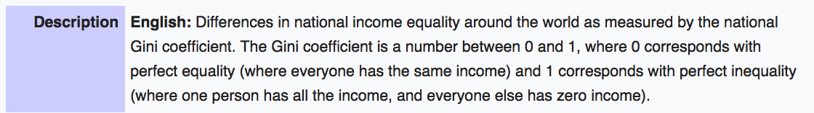
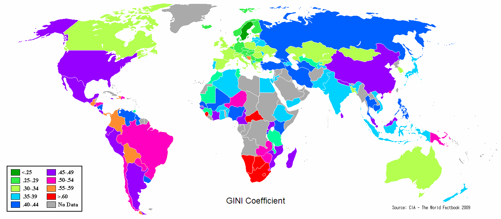

# PROJECT 2: TELL A STORY THROUGH DATA VISUALIZATION

### Team Members:
* Andy Felicitas
* Chinchu John
* Chris Benzen
* Geoffrey Booker
* Lorenzo Yniguez

### Objective:

Our goal for this project is to make an interactive dashboard that displays world development data pulled from the following sources:

* [WHO](http://www.who.int/en/)
* [IMF](http://www.imf.org/external/index.htm)
* [Data.gov](https://www.data.gov/)

Our dashboard will have <b>three dynamic visualizations</b> using d3, plotly and leaflet. 

Our data will be stored in a SQLite database and our website will be deployed through a Python Flask App. 

Design, styling and functionality of our dashboard will be achieved through bootstrap, html/css and javascript.

### Questions to answer
* #### The end user will be able to analyze the following:

    * GDP per capita and income inequality seen through the gini coefficient.
    * Homicide rates and the cost of living index seen through grocery costs.

### Gini Coefficient

 

